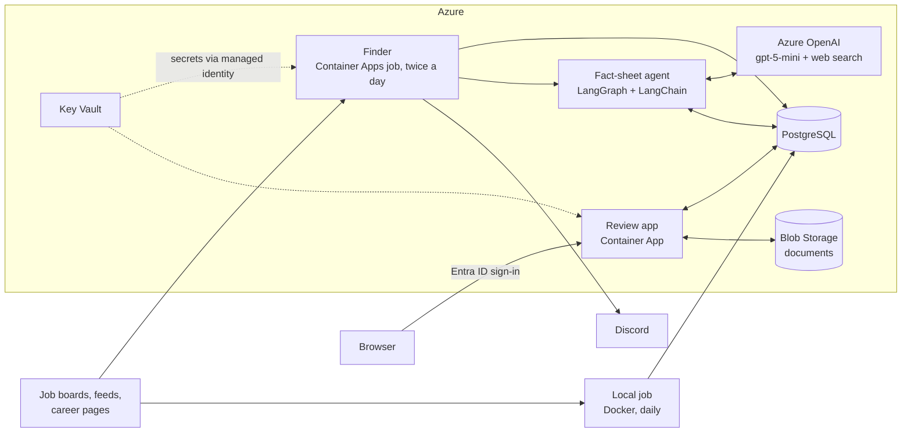

# Job Finder

A personal job-search assistant for entry-level IT roles in Germany. It collects
listings from job boards, open feeds and company career pages, merges listings of
the same job, filters out clear misfits with transparent rules and lets an LLM
agent write a short fact sheet for the promising ones, within a hard cost limit.
A small web app supports the review and tracks applications.

The user interface and the detailed documentation are in German, because the tool
serves a job search in Germany. This page is the English overview.

## Highlights

- **LLM agent with guardrails:** a LangGraph graph with a LangChain model on Azure
  OpenAI (Responses API with web search) writes a structured fact sheet per job:
  seven traffic-light lines, a verdict and a short reason. Its tools only read, job
  ads and web pages count as material rather than instructions, and only links the
  model actually saw survive as sources.
- **Cost control in layers:** every model and tool call passes a cost guard backed
  by a ledger in PostgreSQL, with limits per job, day and month that fail closed.
  In Azure, a throttled model deployment, a token alert and a monthly budget add to
  it. A fact sheet costs a few cents.
- **Azure without account keys:** storage and the model accept only Entra ID,
  secrets come from Key Vault through a managed identity, and the review app sits
  behind Entra ID sign-in for one account. It becomes public only after its
  sign-in is configured, and every deploy checks that it serves nothing without
  sign-in.
- **Infrastructure as code and gated delivery:** Terraform manages all resources.
  GitHub Actions sign in to Azure with OIDC, using separate identities for plan,
  build and apply; production deploys wait for manual approval and roll out only
  the current `main`.
- **Supply chain:** builds install the exact versions from `uv.lock`, actions are
  pinned to commit SHAs, and the image runs as a non-root user without pip or uv.
  CI scans the image and the Terraform code with Trivy; a new Terraform finding
  fails the pull request, and the accepted ones are documented with a reason.
  CodeQL analyses the code, and Dependabot proposes updates every week.
- **Careful data handling:** PostgreSQL with advisory locks and consistent
  snapshot reads; a source that fails never wipes the listings it found before.
- **Tests:** 460+ Python tests that run in CI against a real PostgreSQL, plus
  frontend tests and Ruff for lint and formatting.

## Architecture



A finder run works in five steps:

1. Sources deliver listings. If more than half of them fail, the run stops before
   it replaces any stored results.
2. A rule-based prefilter checks location, remote share, experience, employment
   type, travel and IT fit. Its score sorts; it does not predict suitability.
3. Promising candidates get their detail pages, and listings of the same job
   become one card, also across portals and runs.
4. Results, the job memory and the Discord queue are stored in PostgreSQL; new
   matches go to Discord.
5. The agent writes fact sheets for undecided jobs that are entry level or score
   above 50, best first, until a limit is reached.

Two sources run in a daily local job in Docker, with the same image and against
the same database. Every push to `main` runs the tests, builds the image and,
after approval, applies Terraform and rolls the image out to the finder job and
the review app.

## Tech stack

| Area | Technology |
| --- | --- |
| Language | Python 3.11+ (CI tests 3.11 and 3.13), dependencies locked with uv |
| AI agent | LangGraph, LangChain (`langchain-openai`), Azure OpenAI `gpt-5-mini` |
| Data | PostgreSQL 18 with psycopg 3, Azure Blob Storage |
| Web app | Python standard-library HTTP server, vanilla JavaScript |
| Cloud | Azure Container Apps (job and app), Database for PostgreSQL Flexible Server, Key Vault, Container Registry, Monitor |
| Infrastructure | Terraform (`azurerm`, `azapi`), Docker |
| CI/CD | GitHub Actions with OIDC and environment approval |
| Quality | `unittest` against PostgreSQL, `node:test`, Ruff, CodeQL, Trivy, tflint, Dependabot |

## Quickstart (local)

Requirements: Python 3.11 or newer, [uv](https://docs.astral.sh/uv/) (for example
`python -m pip install --user uv`) and Docker; Node.js 18 or newer only for the
frontend tests. From the repository root:

```powershell
uv sync
uv run python scripts/setup_postgres.py
docker compose --env-file .env.postgres up -d --wait
uv run python -m job_finder.db init
uv run python run_finder.py
uv run python -m job_finder.review
```

`uv sync` installs exactly the versions in `uv.lock` into `.venv`. The review
opens at `http://127.0.0.1:8765`. Without `user_settings.local.yaml`
the anonymised example settings apply. The agent stays off until
`agent.enabled: true` is set and an Azure OpenAI endpoint and a profile are
configured.

## Documentation (German)

- [Bedienung](docs/bedienung.md): features, sources, review workflow, rules and
  the agent's settings
- [Betrieb](docs/operations.md): database, backups, Azure, the local job and
  access paths
- [Entwicklung](docs/development.md): structure, data flow of a run, adding a
  source and code style

## License

MIT, see [LICENSE](LICENSE).
