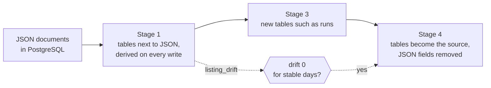

# 0003: Move from JSON documents to tables in stages

- Status: accepted, in progress
- Date: 2026-10-07, recorded 2026-10-08

## Context and problem

The finder first stored its state in JSON files. The move to PostgreSQL kept
their shape: whole documents per data set, with the details of a job in a JSONB
field `extra`. That worked, but every list loads and replaces whole documents,
queries have to look into JSON, and the database cannot check references. At the
same time, the production data (decisions, applications, documents) must not be
lost or changed by the migration, and a rollback to the previous image must stay
possible.

## Considered options

1. Keep the documents and only add indexes where it hurts.
2. Migrate everything to a new schema in one step.
3. Expand and contract: add tables next to the JSON fields, keep the JSON as the
   source for a while, derive the tables from it on every write, and remove the
   old fields only once the tables have run without drift.

## Decision

Option 3, in stages:

1. Stable identities and constraints: tables `job_listings` and `job_links` and
   columns on `job_state`, derived from `extra` (revision `0005`).
2. Targeted queries with pagination for review and agent: skipped for now, see
   below.
3. Tables for things that were documents before, starting with `runs`
   (revision `0006`).
4. After stable days, make the tables the source and remove the JSON fields and
   the indexes that only served them.

Every migration is reviewed by hand, tested against a copy of the production
data and run separately before the matching release (see
[0007](0007-deployment-responsibility.md)).

## Consequences

- Until stage 4, every write updates JSON and tables together; `listing_drift`
  in every run summary and `job_finder.db listings-drift` show deviations, and
  `--repair` derives the tables again.
- An older image keeps working during the expand stages, because it still finds
  the JSON fields.
- Stage 2 was skipped after measuring: the review list loads in about 0.6 s
  once the app runs, and the agent deliberately uses the same list as the
  review, because only the review maps listings to the user's decisions.
- Stage 4 is a contract migration: after it, an image from before stage 1 is no
  longer a way back, so it needs a backup and a deliberate release.

## Revisit when

- Drift appears in production; then the derivation is fixed before going on.
- The review list grows enough that pagination pays off.
