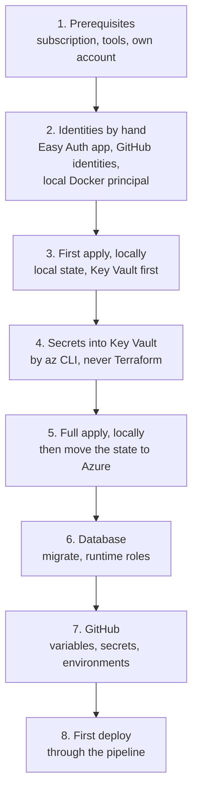

# Setting up the cloud from scratch

How a new Azure subscription gets the job finder: what has to exist before
Terraform can run, what Terraform creates, what is set by hand afterwards and
what the deploy pipeline needs. The order follows the Terraform configuration
in `infrastructure/`; the original setup happened step by step during the move
to Azure, so treat this as the checklist for a rebuild rather than a script.
Day-to-day operation is in [Operations](operations.md).



## 1. Prerequisites

- An Azure subscription where the own account is **Owner** (role assignments
  and delete locks need it) and an Entra ID tenant.
- Azure CLI, Terraform 1.11 or newer, Docker, Python with uv; a GitHub copy of
  the repository.
- The own account's object ID (`az ad signed-in-user show --query id -o tsv`)
  for `owner_object_id`. It is fixed on purpose, so a pipeline run never moves
  the owner's rights to the pipeline.

## 2. Identities created by hand

Terraform cannot grant itself the rights it needs to run, so these app
registrations and service principals come first, with `az ad app create` and
`az ad sp create`; their IDs go into `infrastructure/terraform.tfvars`:

| Identity | Purpose | Terraform variable |
| --- | --- | --- |
| Review sign-in app | Easy Auth for the review; delegated permission `User.Read` (Microsoft Graph), a client secret, redirect URI `https://<review host>/.auth/login/aad/callback` | `review_aad_client_id` |
| GitHub apply | `terraform apply` and rollout after approval | `github_actions_sp_object_id` |
| GitHub build | pushes images only | `github_build_sp_object_id` |
| GitHub plan | read-only plans in pull requests | `github_plan_sp_object_id` |
| Local Docker | the hybrid run's database and model access | `local_docker_sp_object_id` |

The three GitHub identities sign in through OIDC: give each a federated
credential for this repository (apply: environments `production` and
`production-plan`; build: branch `main`; plan: pull requests). None of them gets
a stored secret.

## 3. First apply, locally

The backend in `infrastructure/providers.tf` keeps the state in the project's
storage account, which this apply creates. For the very first run, comment the
`backend "azurerm"` block out and start with a local state. The job and the
review refer to Key Vault secrets that must already exist, so the first apply
creates only the vault and the own access to it:

```powershell
terraform -chdir=infrastructure init
terraform -chdir=infrastructure apply -target=azurerm_key_vault.jobfinder -target=azurerm_role_assignment.keyvault_secrets_officer_dev
```

Private values come from `infrastructure/terraform.tfvars` and
`infrastructure/postgres.auto.tfvars.json` (both ignored by Git; the admin
password as `TF_VAR_postgres_admin_password`, see [Operations](operations.md#azure)).

## 4. Secrets into Key Vault

Secret values go in only through the Azure CLI, never through Terraform, so they
never end up in the state:

| Secret | Content |
| --- | --- |
| `JobfinderUserSettings` | content of `user_settings.local.yaml` |
| `JobfinderProfile` | content of `profile.local.yaml`, the agent's profile |
| `DiscordWebhookUrl` | optional Discord webhook |
| `StartupJobsApiKey` | optional key for Startup Jobs |
| `ReviewAadClientSecret` | client secret of the review sign-in app |
| `JobfinderDatabaseUrl` | the app role's database URL (shared `legacy` mode) |
| `JobfinderWorkerDatabaseUrl`, `JobfinderReviewDatabaseUrl` | separate logins after [runtime access](runtime-access.md) |

On Windows, set file contents with the UTF-8 call from [Usage](usage.md#setup).

## 5. Full apply, then move the state

```powershell
terraform -chdir=infrastructure apply
```

This creates resource group, registry, Log Analytics, the Container Apps
environment, worker job and review app, PostgreSQL, storage, the model
deployment, monitoring and all role assignments. The review stays internal until
its sign-in exists; `review_public` makes it public afterwards. The two delete
locks need Owner rights, which is why this apply runs locally.

Then create the container `tfstate` in the storage account, restore the
`backend` block and move the state:

```powershell
az storage container create --auth-mode login --account-name <storage account> --name tfstate
terraform -chdir=infrastructure init -migrate-state
```

## 6. Database

Run the migrations as admin and create the restricted runtime roles, as
described in [Operations](operations.md#azure) and
[runtime access](runtime-access.md):

```powershell
uv run python -m job_finder.db migrate
uv run python scripts/create_runtime_roles.py --target azure
```

Optionally switch to Entra token sign-in later
([database sign-in with Entra](database-auth.md)).

## 7. GitHub

| Kind | Name | Value |
| --- | --- | --- |
| Variable | `AZURE_TENANT_ID`, `AZURE_SUBSCRIPTION_ID` | tenant and subscription |
| Variable | `AZURE_CLIENT_ID`, `AZURE_CLIENT_ID_BUILD`, `AZURE_CLIENT_ID_PLAN` | client IDs of the three GitHub identities |
| Variable | `RUNTIME_IDENTITY_PHASE`, `RUNTIME_ACCESS_VERIFIED`, `DATABASE_AUTH_PHASE`, `DATABASE_ENTRA_VERIFIED` | phases, see runtime access and Entra docs |
| Secret | `POSTGRES_ADMIN_PASSWORD`, `POSTGRES_CLIENT_IPV4`, `ALERT_EMAIL`, `REVIEW_FQDN` | the same values as locally |
| Secret | `POSTGRES_ENTRA_ADMIN_NAME` | only with Entra; a secret because it can contain an email address |

Create the environments `production` (with required reviewers) and
`production-plan` (limited to `main`, no reviewers).

## 8. First deploy

Merge to `main` or start the workflow by hand: CI builds the image, plans, and
after the approval in `production` applies the plan and rolls out the image by
digest ([Deploy and rollback](operations.md#deploy-and-rollback)). Afterwards
the deploy summary names the image as the way back. The local hybrid run needs
`.env.postgres-azure` and `.env.docker-local` and a Windows task that runs
`scripts/run_local_hybrid.py` daily ([Operations](operations.md#local-hybrid-run-stepstoneremotely)).
