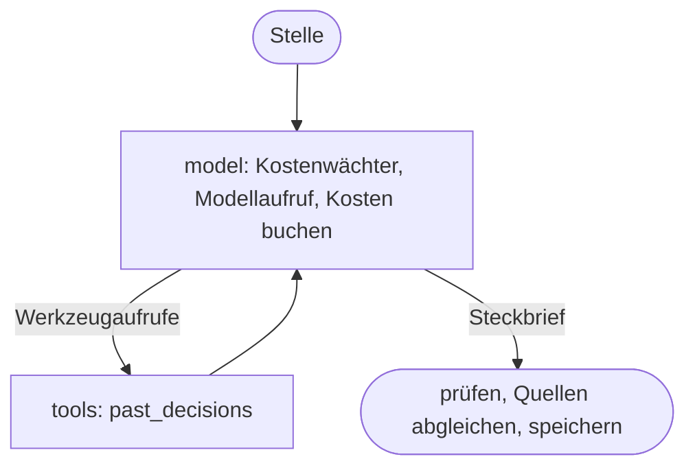

# Entwicklung am Job Finder

Diese Anleitung beschreibt Aufbau und Entwicklung. Einrichtung und Bedienung
stehen in [Bedienung](bedienung.md), der Betrieb in [Betrieb](operations.md).

## Arbeitsumgebung und Prüfungen

Python 3.11 oder neuer und [uv](https://docs.astral.sh/uv/) werden benötigt.
Die Befehle laufen im Repository-Stamm; `uv run` nutzt die `.venv`, ohne dass
sie aktiviert werden muss:

```powershell
uv sync
uv run ruff check .
uv run ruff format --check .
uv run pyright
uv run python scripts/test_postgres.py --cov
node --test tests/frontend.test.cjs
```

Die Abhängigkeiten stehen mit Versionsbereichen in `pyproject.toml`, die exakten
Versionen in `uv.lock`; CI und Image installieren genau diese. Nach einer
Änderung an `pyproject.toml` aktualisiert `uv lock` das Lockfile, sonst scheitert
die CI. Die Gruppe `dev` enthält festgelegte Versionen von Ruff, pytest,
pytest-cov und Pyright, damit lokale Prüfung und CI dieselben Regeln verwenden.
Node.js wird für die Frontend-Tests und für Pyright benötigt; die CI verwendet
Node.js 24.

Die Tests verwenden lokale Fixtures, temporäre Datenpfade, eine separate
PostgreSQL-Testdatenbank ([Betrieb](operations.md#lokale-datenbank)) und
ersetzte Netzwerkzugriffe; ein vollständiger Finder-Lauf gehört nicht dazu.
`scripts/test_postgres.py` prüft die Testdatenbank und startet dann pytest, das
die `unittest`-Klassen unverändert ausführt; weitere Argumente gehen an pytest.
`--cov` misst, welche Zeilen und Verzweigungen in `job_finder/` die Tests
erreichen. Die Zahl hilft, ungetestete Stellen zu finden, und ist kein Ziel für
sich. Pyright prüft die Typen, zunächst für die Datenbankschicht
(`job_finder/persistence`); weitere Pakete kommen schrittweise dazu
(`[tool.pyright]` in `pyproject.toml`).

Der [GitHub-Workflow](../.github/workflows/checks.yml) testet Python 3.11 und
3.13 auf Linux mit PostgreSQL und zeigt die Abdeckung in der Zusammenfassung des
Laufs, prüft Stil, Typen, Frontend und ob `uv.lock` zu `pyproject.toml` passt. Bei Pull Requests baut er außerdem das Image, startet es
kurz als eingeschränkter Benutzer und prüft es mit Trivy auf bekannte Lücken;
tflint und Trivy prüfen den Terraform-Code und brechen bei jedem neuen Befund
ab (bewusste Abwägungen stehen mit Begründung in
[.trivyignore.yaml](../infrastructure/.trivyignore.yaml)), und ein
`terraform plan` gegen den gespeicherten State (`-refresh=false`) zeigt die
Folgen für Azure (nicht für Forks und Dependabot, die keinen Azure-Zugang
haben). CodeQL analysiert Python,
JavaScript und die Workflows ([codeql.yml](../.github/workflows/codeql.yml)),
Dependabot schlägt wöchentlich Updates vor, und alle Actions sind auf
Commit-SHAs festgelegt. Nach einem Merge auf `main` baut er das Image, prüft es
erneut, pusht es in die Registry, wendet nach manueller Freigabe im Environment
`production` Terraform an und rollt das Image auf Worker und Review aus. Ein neuerer Deploy
bricht einen älteren, noch wartenden ab, und nach der Freigabe rollt er nur aus,
wenn sein Commit noch der aktuelle `main` ist. Terraform verwaltet die
Image-Version nicht; ein lokales `terraform apply` setzt die App also nie
zurück.

Neue allgemeine Änderungen beginnen auf einem aktuellen `main`, zum Beispiel
auf `docs/...`, `fix/...` oder `feat/...`. Inhaltliche und große rein mechanische
Änderungen getrennt committen. Die [PR-Vorlage](../.github/PULL_REQUEST_TEMPLATE.md)
beschreibt Titel und Beschreibung. Das Repository ist öffentlich: Commit- und
PR-Texte bleiben kurz und nennen keine persönlichen Daten, keine Firmen aus
eigenen Bewerbungen, keine Zahlen aus dem eigenen Bestand und keine Azure-Namen.

## Orientierung im Code

| Bereich | Zuständigkeit |
| --- | --- |
| `run_finder.py` | CLI, Quellenkoordination und Reihenfolge der Pipeline |
| `job_finder/workflow/main.py` | Vorhandene Jobs bewerten, Anzeigen einer Stelle zu einer Karte vereinen und Ergebnisse zusammenstellen |
| `job_finder/sources/` | Quellen abrufen und in `Job`/`JobSource` umwandeln |
| `job_finder/models.py` | Datenmodell, Statuswerte und Serialisierung |
| `job_finder/matching/deduplication.py` | Gleiche Anzeigen verschiedener Quellen zusammenführen |
| `job_finder/matching/scoring.py`, `matching_rules.py`, `remote.py` | Bewertungsablauf, Erkennungsregeln und Remote-Erkennung |
| `job_finder/matching/experience.py`, `location_rules.py`, `salary.py`, `matching_text.py` | Zusammenhängende Analysen und normalisierte Textvergleiche |
| `job_finder/workflow/memory.py` | PostgreSQL-Zustand, stabile IDs (eine je Stelle, auch über Portale und Läufe) und frühere Entscheidungen |
| `job_finder/workflow/availability.py` | Fehlende interessante Stellen auf bestätigte Schließung prüfen |
| `job_finder/review.py`, `job_finder/workflow/review_data.py`, `review_actions.py` | HTTP-Server, Review-Datenaufbereitung und transaktionale Aktionen |
| `job_finder/workflow/applications.py`; `job_finder/persistence/application_documents.py`, `document_store.py` | Bewerbungsverlauf und Unterlagen (lokal oder im Blob Storage) |
| `job_finder/app.js`, `landing.js`, `review.js`, `applications.js` und zugehörige HTML-Dateien | Gemeinsame Browser-Helfer, Seitenskripte und Arbeitsansichten |
| `job_finder/workflow/reporting.py`, `notifications.py` | Review-Ausgabe und Discord-Warteschlange |
| `job_finder/matching/user_settings.py`, `config.py`; `job_finder/paths.py` | Konfiguration, Suche und lokale Dateipfade |
| `job_finder/agent/`; `job_finder/persistence/agent_usage.py`, `fact_sheets.py`, `decisions.py` | KI-Agent: Schalter und Grenzen, Profil, Preise und Kostenwächter, Anweisungen, Werkzeuge, Steckbrief-Struktur, LangGraph-Graph je Stelle und Einbindung in den Lauf; Kostenbuch, Steckbriefe und frühere Entscheidungen in PostgreSQL |

### Datenfluss eines Finder-Laufs

1. Lokal wird zuerst der Datenbestand gesichert; in Containern entfällt
   dieses Backup. Danach liefern Quellen Treffer und Abdeckungsangaben; URLs
   und quellenübergreifende Duplikate werden zusammengeführt. Sind mehr als
   die Hälfte der Quellen unbrauchbar, stoppt der Lauf vor dem Ersetzen von
   Job-Snapshot und Review-Ausgabe.
2. Ein erster Vorfilter bestimmt die Kandidaten für optionale Detailabrufe.
   Quellen dürfen deren Job-Objekte ersetzen oder bestätigte geschlossene
   Anzeigen aus der Liste entfernen.
3. Die angereicherten Jobs werden endgültig bewertet. Diese Ergebnisse
   bleiben mit den Job-Objekten verbunden, während das Gedächtnis anschließend
   IDs, Erstfund-Merkmale und bestehende Workflow-Entscheidungen zuordnet.
   Anzeigen mit gleichem Titel und passender Firma erhalten dabei dieselbe ID,
   auch über Portale und Läufe hinweg; eine schon entschiedene Stelle nur ohne
   neuen Ort oder wenn beide komplett remote sind. Danach werden sie zu einer
   Karte, angeführt von der bestbewerteten Anzeige.
4. Die Offline-Prüfung betrachtet fehlende interessante Stellen ohne
   Bewerbungsverlauf, und nur wenn alle bekannten Quellen der Stelle, die
   dieser Lauf abfragt, vollständig erfolgreich waren; ebenso zählt das
   Gedächtnis Fehlläufe. Netzwerkabrufe erfolgen außerhalb der
   PostgreSQL-Schreibtransaktionen; vor einer Statusänderung wird der aktuelle
   Nutzerentscheid erneut geprüft.
5. Job-Snapshot und Empfehlungen werden geschrieben; Anzeigen übersprungener
   Quellen bleiben erhalten, auch an Stellen, die dieser Lauf erneut gefunden
   hat. Die Discord-Warteschlange wird aktualisiert und bei jedem Lauf direkt
   versendet.

`is_new` beschreibt einen Erstfund im Suchlauf. `workflow_status="new"`
bedeutet dagegen, dass die Stelle noch nicht bearbeitet wurde. Der Review-
Filter „Neu“ richtet sich nach dem Workflow-Status und seinen Sichtbarkeitsfiltern.
Diese Merkmale dürfen bei Änderungen nicht gleichgesetzt werden: Ein Abbruch
nach dem Speichern des Gedächtnisses und ein Neustart entfernen unbearbeitete
Stellen deshalb nicht aus „Neu“.

### Offline-Prüfung

Geprüft werden nur fehlende interessante Stellen ohne Bewerbungsverlauf, nicht
unbearbeitete Stellen mit Status Neu. Aktuelle Treffer werden übersprungen,
veraltete Cache-Treffer gelten als fehlend. Die Anfragen laufen sequenziell,
höchstens 200 URLs pro Lauf; nach zwei Minuten beginnt keine neue mehr, eine
laufende darf fertig werden. Ergebnisse gelten 24 Stunden, auch unklare; offene
Prüfungen verteilen sich auf spätere Läufe und ändern den Status nicht. Eine
Stelle wird nur „Nicht interessant“, wenn alle ihre URLs in den letzten 24
Stunden eindeutig als geschlossen bestätigt wurden; fehlende Suchtreffer,
Login-Weiterleitungen und Abruffehler reichen nicht.

### Laufausgabe

Jede Quelle erhält eine Ergebniszeile mit Treffern, Dauer und gegebenenfalls
Teilergebnis oder Fehler. Konsole und Laufprotokoll zeigen außerdem die Dauer
der Detailanreicherung und der Pipeline-Schritte, bei abgebrochenen Schritten
die bis dahin verstrichene Zeit; verschachtelte Zeiten überlappen und ergeben
addiert nicht die Gesamtlaufzeit. Im Terminal werden Fortschrittszeilen
ersetzt, ohne Terminal erscheinen zeitgestempelte Zwischenstände höchstens alle
30 Sekunden je Vorgang. Die Offline-Prüfung zeigt erledigte und geplante
eindeutige URLs, aber keine URLs oder Stelleninhalte. Die Review-Diagnose trennt
erstmals gespeicherte und bekannte Treffer, passende und ausgeschlossene neue
Treffer sowie den Status Neu vom Standardfilter Neu.

### Manueller Import

`manual_import.import_manual_url` verarbeitet genau die eingereichte URL und
behält die übrigen Empfehlungen. Ein Vorfilterkonflikt bleibt als Warnung
sichtbar; er verhindert die manuelle Sichtung nicht. Im Standardbetrieb lädt
sie die Seite vor jeder Sperre und schreibt danach manuelle Quelle, Gedächtnis,
Job-Snapshot und Empfehlungen in einer gemeinsamen PostgreSQL-Transaktion.
Mit ausdrücklich anderen Dateipfaden, etwa in Tests, laufen diese
Schreibvorgänge nacheinander ohne gemeinsame Transaktion.

### KI-Agent

Der Steckbrief einer Stelle entsteht in einem LangGraph-Graphen
(`job_finder/agent/runner.py`). Der Knoten `model` prüft den Kostenwächter,
ruft das Modell über `ChatOpenAI` (LangChain, Responses-API des eigenen Azure
OpenAI) und bucht die Kosten; fordert das Modell Werkzeuge an, führt `tools` sie
aus und gibt die Ergebnisse zurück. Antwortet das Modell ohne Werkzeugaufruf,
ist das der Steckbrief; er wird geprüft, seine Quellen werden gegen die
tatsächlich gesehenen Links abgeglichen und dann gespeichert.



Die Bing-Suche läuft als eingebautes Werkzeug im Modellaufruf selbst. Die
abgerechnete Zahl der Suchen reicht LangChain nicht weiter; `agent_model` liest
sie deshalb aus der HTTP-Antwort mit. Die Tests schicken das echte
LangChain-Modell gegen einen simulierten Endpunkt (`httpx.MockTransport`).
LangSmith-Tracing ist nicht eingerichtet; ohne gesetzte `LANGSMITH_*`-Variablen
verlässt nichts den eigenen Rechner beziehungsweise Azure.

### Evals

Die Evals in `evals/` messen, wie gut die Steckbriefe zu beschrifteten Fällen
passen. `evals/cases/synthetic.yaml` enthält eine erfundene Person mit Profil
und Orten, zwei frühere Entscheidungen und 24 erfundene Anzeigen; auch Firmen
und Links sind erfunden. Je Fall stehen die erlaubten Fazit-Stufen, erwartete
Ampeln und ein Satz zur maßgeblichen Regel aus `job_finder/agent/instructions.py`.
Zwei Varianten schreiben die Steckbriefe: `agent` ist der Graph aus dem Betrieb
mit `past_decisions`, das die Entscheidungen der Falldatei durchsucht;
`einzelaufruf` ist ein einziger strukturierter Aufruf mit denselben Regeln, aber
ohne Graph und Werkzeuge. Die Websuche ist in beiden aus, weil sie zu erfundenen
Firmen nichts findet, aber Geld kostet.

Geprüft wird ohne Modell, Feld für Feld: das Fazit unter den erlaubten Stufen,
die Richtung (bewerben oder erst klären gegenüber eher streichen oder
streichen), die erwarteten Ampeln und ob die Texte Geldbeträge nennen, die die
Anzeige nicht enthält. Dazu zählen Abbrüche, verworfene Links (Quellen, die das
Modell nie gesehen hat), Werkzeugaufrufe, Kosten und Laufzeit. Ein Abbruch zählt
als falsches Urteil. Lehnt Azures Inhaltsfilter eine Anfrage ab, bevor das
Modell sie sieht, steht der Fall als „blockiert“ im Bericht; nur Fälle mit
`blockade_ok` (die Angriffe) zählen das als abgewehrt.

Ein Lauf kostet echtes Geld beim Azure-OpenAI-Deployment und startet deshalb nur
von Hand, angemeldet wie der lokale Agent (`az login`):

```powershell
$env:JOBFINDER_OPENAI_ENDPOINT = az cognitiveservices account list --resource-group rg-jobfinder --query "[0].properties.endpoint" -o tsv
uv run python -m evals --budget 1.00
```

`--budget` ist ein hartes Limit für den ganzen Lauf, höchstens 5 €. Die Kosten
führt der Lauf nur im Speicher: Tages- und Monatsgrenze des Agenten im Betrieb
bleiben unberührt, das Azure-Budget sieht sie trotzdem. `--variant`, `--only`,
`--repeat` (mehrere Durchgänge, weil Modellantworten schwanken) und `--effort`
grenzen den Lauf ein; `--searches 1-3` erlaubt dem Agenten die bezahlte
Websuche. Bericht und Rohdaten landen in `evals/results/`, als Markdown und als
JSON mit Commit, Datensatz- und Regel-Hash. Ins Repository kommt nur der Bericht
synthetischer Läufe; die Rohdaten mit allen Steckbriefen bleiben lokal.

Echte Fälle aus der eigenen Review bleiben lokal. `python -m evals.private_cases
--azure [--limit 40]` liest lesend die entschiedenen Stellen, die der Agent im
Betrieb bekäme, samt Anzeige, eigenem Profil und Orten, und schreibt sie nach
`evals/private/` (von Git ignoriert). Soll ist die Richtung der eigenen
Entscheidung: interessant, Rückfrage oder beworben heißt bewerben oder erst
klären, nicht interessant heißt eher streichen oder streichen. Das Werkzeug
`past_decisions` sieht je Fall nur Entscheidungen, die davor lagen. Gestartet
wird wie oben mit `--cases evals/private/faelle.yaml --out
evals/private/results`. Die Tests prüfen Falldatei, Bewertung und einen ganzen
Lauf gegen einen simulierten Endpunkt, ohne Kosten.

### Demo-Daten

`scripts/demo_data.py` füllt eine eigene lokale Datenbank `jobfinder_demo` mit
den erfundenen Anzeigen aus `evals/cases/synthetic.yaml` und den Angaben aus
`demo/demo.yaml`: Sucheinstellungen der erfundenen Person, eine zweite Stelle
für die Warteliste, Entscheidungen und Bewerbungen (in Tagen vor heute, damit
die Demo nicht altert) und drei Steckbriefe aus einem Eval-Lauf. Den Vorfilter
durchlaufen die Anzeigen wie im Betrieb; das Modell wird nicht aufgerufen.
`--serve` startet danach die Review unter `http://127.0.0.1:8770`. Das Skript
leert die Demo-Datenbank bei jedem Lauf und verweigert jeden Datenbankserver,
der nicht lokal läuft. Die Bilder in `docs/images/` stammen aus dieser Demo.

## Eine Quelle ergänzen

Eine Quelle liegt unter `job_finder/sources/<name>.py` und liefert Instanzen
des gemeinsamen Modells statt eigener Job-Dictionaries. Zunächst eine vorhandene
ähnliche Quelle prüfen. Eine Karriereseite, deren Detailseiten JSON-LD liefern
und einem gemeinsamen URL-Muster folgen, braucht kein eigenes Modul: Dafür
genügt ein `CareerPage`-Eintrag in `sources/company_careers.py`, bei
nummerierten Seiten `PaginatedCareerPage`.

Der vom Runner erwartete Vertrag:

| Schnittstelle | Verhalten |
| --- | --- |
| `SOURCE_NAME` | Stabiler Quellenname für IDs, Cache und Laufdiagnose |
| `fetch_jobs()` | Liefert eine Liste von `Job`; bei einem vollständigen Quellenfehler darf eine Exception propagieren |
| `enrich_candidate_jobs(jobs, candidate_ids)` (optional) | Verändert die übergebene Liste beziehungsweise ihre Jobs und liefert die Anzahl betroffener Anzeigen; nicht ladbare Kandidatendetails meldet sie über `record_candidate_failure()` |

Eine Quelle mit mehreren Suchen meldet ihre Abdeckung während `fetch_jobs()`;
der Runner bildet daraus Status und Details:

```python
from job_finder.sources.common import record_partial_failure, record_total_segments

record_total_segments(len(searches))
record_partial_failure(failed_searches)
```

Bei einem abgefangenen Teilfehler muss die Quelle diesen über
`record_partial_failure()` melden. Ein stilles `[]`
könnte sonst als vollständig erfolgreiche Suche ohne Treffer interpretiert
werden. Der Runner verwendet die Zustände `success`, `empty`, `partial` und
`failed`, um fehlende Treffer richtig zu behandeln.

Scheitert nach dem Vorfilter die Detailseite eines Kandidaten, meldet die
Quelle das über `record_candidate_failure()`. Der Quellenstatus bleibt dabei
unverändert, weil die Suche selbst vollständig war. Die Discord-Laufstatistik
und das Logereignis `enrichment_completed` weisen die fehlenden Details aus.

Für Details übernimmt `fetch_cached_details` den gemeinsamen Cache: sieben
Tage frisch, bei Abruffehlern höchstens 14 Tage als markierter Fallback.
`ListingUnavailableError` kennzeichnet eindeutig geschlossene Anzeigen und
entfernt ihren Detailcache. Andere Fehler sind kein Schließungsnachweis.
Quellenspezifische Suchfenster oder Cache-Regeln können davon abweichen und
gehören in den jeweiligen Modul-Docstring.

Beim Ergänzen einer Quelle:

1. Herkunft in `JobSource` erhalten; Anzeigen-URL und gegebenenfalls direkte
   Bewerbungs-URL unterscheiden. IDs stabil erzeugen. Unbekannte Datums- und
   Gehaltsangaben nicht schätzen. Gehälter im Modell sind EUR-Jahresbrutto.
2. Gemeinsame HTTP-, Text-, JSON-LD- und Remote-Helfer verwenden, soweit sie
   zur Seite passen. Bei manuell eingegebenen URLs auch Weiterleitungen durch
   `validate_public_url` prüfen lassen.
3. Das Modul beziehungsweise den `CareerPage`-Eintrag in `run_finder.py`
   importieren und in `SOURCES` registrieren. Optionale Zugangsdaten nur über
   Umgebungsvariablen beziehen; bei Bedarf die Quelle nur bei vorhandener
   Konfiguration aktivieren.
4. Parser und Quellenausfälle mit kleinen Fixtures testen: reguläre Anzeige,
   fehlende optionale Felder, Teilfehler und Cache-/Schließungsfälle. Keine
   kompletten fremden Webseiten mit Trackingdaten als Fixtures übernehmen.
5. Quelle und besondere Einschränkungen in [Bedienung](bedienung.md) ergänzen.

Adapter erhalten weder Datenbankverantwortung noch persönliche
Workflow-Entscheidungen. Sie liefern Anzeigen und ihre Herkunft; Filter und
Speicherung bleiben in den gemeinsamen Modulen.

## Zustandsänderungen und Konfiguration

`paths.py` legt alle Pfade relativ zum Projekt fest. Es gibt keinen allgemeinen
`DATA_DIR`-Umgebungsvariablen-Schalter; nur der Dokumentordner lässt sich über
`JOBFINDER_DOCUMENTS_DIR` verlegen. Tests reichen abweichende Pfade über
Funktionsparameter oder gezielte Patches ein.

- Der dauerhafte Stellen- und Bewerbungszustand liegt in PostgreSQL.
  `MEMORY_FILE` (`data/internal/job_finder.sqlite3`) ist nur noch der Schlüssel
  dieses Bestands; andere Pfade sind allein in isolierten Tests erlaubt. Für
  Änderungen `edit_memory` verwenden, damit Lesen, Ändern und Speichern
  gemeinsam gesperrt sind. `update_memory` verändert die übergebenen Objekte,
  schreibt allein aber nicht in die Datenbank.
- JSON-Pfade direkt unter `data/internal` und `data/output` benennen
  PostgreSQL-Datensätze (`storage.dataset_name`), keine Dateien; nur andere
  Pfade werden als JSON-Datei gelesen oder geschrieben. `jobs.json` und
  `recommendations.json` sind neu erzeugbare Ausgaben; `*_cache.json` enthält
  wiederverwendbare Quelldetails.
- `notifications.json` enthält die Discord-Warteschlange und den Versandstatus.
  Auch `process_notifications(send=False)` verändert diesen Datensatz.
- Bewerbungsunterlagen liegen je nach `JOBFINDER_DOCUMENTS_BACKEND` im
  Dokumentordner (`local`, Standard) oder im Blob Storage (`blob`); ihre
  Metadaten stehen in PostgreSQL. `python -m job_finder.db backup` und das
  automatische Backup vor lokalen Finder-Läufen enthalten die referenzierten
  Dokumente samt Prüfsummen.

`user_settings.local.yaml` wird beim Import der Konfigurationsmodule gelesen.
Ohne diese Datei wird die anonymisierte Beispielkonfiguration verwendet. Ist
`JOBFINDER_USER_SETTINGS` gesetzt (in Azure aus dem Key Vault), hat deren
YAML-Inhalt Vorrang; `SETTINGS_SOURCE` nennt die tatsächliche Quelle.
Nach Änderungen laufende Prozesse neu starten. Persönliche Konfiguration,
Dokumente, Datenbanken und Zugangsdaten bleiben außerhalb von Git.

`score_job` liefert ein Ergebnis-Dictionary, keine einzelne Prozentzahl.
Ausgeschlossene Ergebnisse enthalten einen Score von 0 und den ersten
Ausschlussgrund; nur regulär eingeschlossene Ergebnisse besitzen zusätzlich
`role_group` und `location_precheck`. `score_for_pipeline` ergänzt die
Sonderbehandlung manueller Einträge. Diese Ergebnisse sind Sortierhilfen,
keine Vorhersagen einer Einstellungschance.

Die Bewertung prüft zuerst das Anzeigenalter, danach die Anforderungen und
zuletzt den Standort. Die erste Ablehnung bleibt der sichtbare Ausschlussgrund.
Erfahrungsjahre und Standortanalyse werden anschließend für die Punktevergabe
wiederverwendet. Bei Änderungen diese Reihenfolge und die Grenzwerte erhalten.

### Eigenständiger Vorfilter und persönliche Präferenzen

`matching_rules.py` enthält Rollenbegriffe, Kontextbedingungen und
Ausschlussmerkmale ohne persönliche Werte oder Punkte. Die erste passende
Rollengruppe gewinnt; ihre Reihenfolge ist fachliche Erkennungspriorität und
wird nicht durch persönliche Vorlieben umsortiert.

`user_settings.local.yaml` steuert Standort, Gehalt und über
`matching.profile_domain_keywords` den Bezug zu Projekten oder Weiterbildungen.
Unbekannte Schlüssel werden beim Laden ignoriert. `profile.local.yaml` ist die
Faktenbasis des KI-Agenten; der Vorfilter liest es nicht.

Die Bewertung bleibt eine vollständige, regelbasierte Sortierhilfe:

| Bestandteil | Punkte |
| --- | --- |
| Klare Einstiegsstelle oder erste Erfahrung ausreichend | 25 |
| Erfahrung nur wünschenswert / keine klare Anforderung | 18 / 20 |
| Ein / zwei / drei Jahre gefordert | 14 / 8 / 3 |
| Technologische Vorerfahrung / mehrjährige Erfahrung ohne Jahreszahl | 8 / 6 |
| Vollständig remote / lokal hybrid / lokal vor Ort / erlaubter Pendelort | 15 / 13 / 10 / 8 |
| Erkannte IT-Richtung | 10 bis 30, nach Rolle |
| Technologien im Titel oder Beschreibung | bis 25 insgesamt |
| Mindestens ein konfigurierter Profilbegriff im Anzeigentext | 5 insgesamt |

Die Junior-Hybrid-Ausnahme außerhalb des Suchgebiets bleibt mit null
Standortpunkten sichtbar zuschaltbar. Bestehende Präferenzabzüge folgen auf
die Summe; das Ergebnis bleibt auf 0 bis 100 begrenzt. Es gibt keinen
Mindestscore für die Aufnahme ins Review. Das Wort „Weiterbildung“ in einer
Beschreibung ist kein Ausbildungsmerkmal. `ranking_weights.py` enthält die
Rollen- und Technologiegewichte, getrennt von Erkennungsregeln und persönlichen
Einstellungen.

Die 32 festen Vergleichsfälle in `tests/fixtures/scoring_parity.json` halten
vollständige Bewertungsergebnisse fest. Änderungen an einzelnen
Erkennungsfehlern werden separat getestet; persönliche Anzeigen und Bewertungen
bleiben dabei außerhalb des Repositories.

Die Review-API ordnet POST-Routen kurzen Aktionsmethoden zu. Host-/Origin-Prüfung,
Größenlimit und JSON-Objektprüfung erfolgen gemeinsam vor dem Aufruf der Aktion;
Fehlerantworten und Antwortheader bleiben zentral. Im Browser verwenden die
Bewerbungsformulare denselben Speicherablauf, der ihre Aktionsbuttons auch nach
einem Fehler wieder freigibt.

Fachliche Funktionen werden aus ihrem zuständigen Modul importiert.
Standortregeln bekommen lokale Einstellungen explizit vom Scoring-Einstiegspunkt
übergeben.

## Python-Stil und hilfreiche Dokumentation

Orientierung geben [PEP 8](https://peps.python.org/pep-0008/) und
[PEP 257](https://peps.python.org/pep-0257/). Die konkrete, reproduzierbare
Konfiguration steht in [pyproject.toml](../pyproject.toml).

- Vier Leerzeichen einrücken; englische Bezeichner, Kommentare und Docstrings
  verwenden. Nutzertexte und Projektanleitungen bleiben deutsch.
- Ruff formatiert mit 120 Zeichen als Richtwert und setzt alles auf eine Zeile,
  was hineinpasst; ein Komma am Ende erzwingt keinen Umbruch. Lange URLs,
  Regex-Ausdrücke oder Testdaten können länger bleiben, wenn Aufteilen die
  Lesbarkeit verschlechtert. `E501` wird deshalb nicht pauschal erzwungen; lange
  Kommentar- und Docstring-Absätze von Hand auf etwa 72 Zeichen umbrechen.
- Imports nach Standardbibliothek, Fremdpaketen und Projektcode gruppieren.
  Änderungen an Importreihenfolgen bei Modulen mit Initialisierungseffekten
  zusätzlich inhaltlich prüfen.
- Ein Docstring steht dort, wo er mehr sagt als der Name: Zweck, Grund,
  Randfälle oder Zustandsänderungen. Einer, der nur den Namen wiederholt,
  entfällt; Ruff verlangt deshalb keine Docstrings (`D1xx` ist aus). Er beginnt
  mit einer kurzen Handlungsbeschreibung und einem Punkt; weitere Absätze folgen
  nach einer Leerzeile.
- Bei komplexen Funktionen Eingaben, Rückgaben, Zustandsänderungen und relevante
  Fehler beschreiben. Insbesondere `None`, leere Werte und das Verändern
  übergebener Objekte erklären. Selbstverständliche Parameter nicht nur unter
  anderen Worten wiederholen. Ein festes Google-/NumPy-Abschnittsschema ist
  nicht vorgeschrieben.
- Kommentare begründen Sonderfälle oder Voraussetzungen. Sie sollen nicht
  jede Schleife und Zuweisung nacherzählen. Veraltete Kommentare beim Ändern
  des Verhaltens gleichzeitig aktualisieren.
- Testfälle erhalten sprechende Namen. Konstruktoren und
  Standard-Protokollmethoden brauchen keine bloße Wiederholung; abweichendes
  Verhalten gehört trotzdem dokumentiert.
- Typannotationen sind bei Datenmodellen und neuen klaren Schnittstellen
  hilfreich. Eine flächendeckende Typmigration ist keine Voraussetzung für
  eine Dokumentationsänderung.

Automatisch formatieren und anschließend prüfen:

```powershell
uv run ruff check --select I --fix .
uv run ruff format .
uv run ruff check .
```

Der Linter prüft Form und häufige Fehler. Ob ein Docstring das tatsächliche
Verhalten erklärt und ob eine Fachregel sinnvoll ist, bleibt Teil des Reviews.
