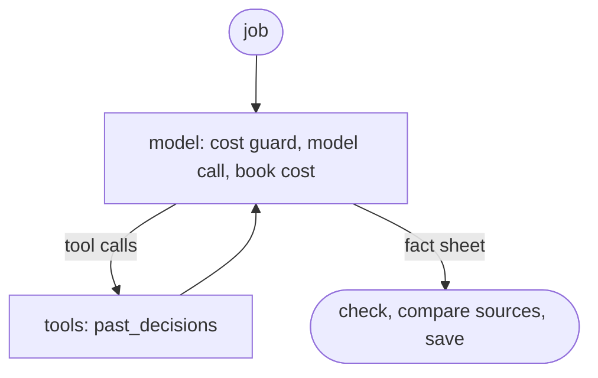

# Developing the Job Finder

This guide describes structure and development. Setup and use are in
[Usage](usage.md), operation in [Operations](operations.md), and the reasons
behind the main design choices in the [architecture decisions](adr/README.md).

## Environment and checks

It needs Python 3.11 or newer and [uv](https://docs.astral.sh/uv/). The
commands run from the repository root; `uv run` uses `.venv` without having to
activate it:

```powershell
uv sync
uv run ruff check .
uv run ruff format --check .
uv run pyright
uv run python scripts/test_postgres.py --cov
node --test tests/frontend.test.cjs
npm ci
npm run check:types
```

The dependencies are listed with version ranges in `pyproject.toml`, the exact
versions in `uv.lock`; CI and the image install exactly those. After a change to
`pyproject.toml`, `uv lock` updates the lock file, otherwise CI fails. The `dev`
group pins Ruff, pytest, pytest-cov, Pyright and Playwright, so local checks and
CI apply the same rules. Node.js is needed for the frontend tests, the type
check of the browser scripts and for Pyright; CI uses Node.js 24.

The browser scripts stay classic scripts without a build. `// @ts-check` and
JSDoc still let TypeScript check them, each page on its own (`typecheck/`).
Pydantic models (`job_finder/api_models.py`) describe the responses of the read
endpoints; from their OpenAPI schema `npm run types:api` generates
`job_finder/api-types.d.ts`, and `job_finder/types.d.ts` gives the types short
names such as `ReviewCard`. When a response changes, model and regenerated
types belong in the same commit; CI fails when the types no longer match the
server or a script reads a field wrongly.

The tests use local fixtures, temporary data paths, a separate PostgreSQL test
database ([Operations](operations.md#local-database)) and replaced network
access; a complete finder run is not part of them. `scripts/test_postgres.py`
checks the test database and then starts pytest, which runs the `unittest`
classes unchanged; further arguments go to pytest. `--cov` measures which lines
and branches in `job_finder/` the tests reach. The number helps to find untested
places and is not a goal in itself. Pyright checks the types of the whole
application package `job_finder`; tests, scripts and evals not yet
(`[tool.pyright]` in `pyproject.toml`).

Boundary tests check promises that nobody would otherwise notice, against the
real test database: the app role reads and writes rows but never changes the
schema and sees neither `schema_version` nor `alembic_version` (a separate test
role, so a real `jobfinder_app` on the same server stays untouched), and a
second concurrent finder run is refused (`tests/test_database_boundaries.py`).

`tests/test_schema_migrations.py` creates its own temporary `_test` databases on
the already isolated test instance and removes them after each test. The test
login needs `CREATEDB` for that and `CREATEROLE` for the role check (the local
and the CI test instance use a superuser). Freshly migrated and adopted
databases are compared through the PostgreSQL catalogs. An independent
historical DDL fixture checks the adoption, including unchanged decisions,
document references, notifications and cost ledger. Structure deviations,
unknown versions, inherited app rights and aborts after DDL or the baseline
stamp are regressions of their own. These tests run in the normal PostgreSQL
suite and so in CI as well.

`tests/test_runtime_permissions.py` checks F09 with unique local worker, review
and hybrid roles and capability groups for each test. Besides allowed real
review flows, it checks direct rights violations, indirect deletion through
record cascades, `SET ROLE`, later tables and unchanged passwords. The tests
remove their roles and restore the policy afterwards. The Terraform tests in
`infrastructure/tests/runtime_access.tftest.hcl` check `legacy`, `prepare`, a
refused `split` and an approved `split` with fully simulated providers
(`terraform test`). They create no Azure resources. The later cloud acceptance
that is still needed is described in [runtime-access.md](runtime-access.md).

The browser tests (`tests/test_review_browser.py`) click through the review in
Chromium on freshly filled demo data: fact sheet, decision with note, waiting
list, undo and application with a document. Each test starts its own demo
review. Without `JOBFINDER_BROWSER_TESTS=1` they are skipped; locally, download
Chromium once, then run them as in CI:

```powershell
uv run playwright install chromium
$env:JOBFINDER_BROWSER_TESTS = "1"; uv run python scripts/test_postgres.py tests/test_review_browser.py
```

The [GitHub workflow](../.github/workflows/checks.yml) tests Python 3.11 and
3.13 on Linux with PostgreSQL and shows the coverage in the run's summary; it
checks style, types, frontend and whether `uv.lock` matches `pyproject.toml`;
separate jobs run the browser tests and the quickstart from the README. For
pull requests it also builds the image, starts it briefly as a restricted user
and scans it for known vulnerabilities with Trivy; tflint and Trivy check the
Terraform code and fail on every new finding (deliberate trade-offs are listed
with their reason in [.trivyignore.yaml](../infrastructure/.trivyignore.yaml)),
and a `terraform plan` against the stored state (`-refresh=false`) shows the
consequences for Azure (not for forks and Dependabot, which have no Azure
access). CodeQL analyses Python, JavaScript and the workflows
([codeql.yml](../.github/workflows/codeql.yml)), Dependabot proposes updates
weekly, and all actions are pinned to commit SHAs. After a merge to `main` it
builds the image, checks it again and pushes it to the registry. Then it creates
a Terraform plan reconciled with the real Azure state, stores it privately next
to the state and shows in the run only which resources would change how. The
manual approval in the environment `production` applies to exactly this plan:
the apply loads it, checks its checksum and applies it; if the state has changed
since, Terraform aborts. Afterwards it rolls out the image by digest to worker
and review, checks the sign-in protection and waits until the new review
revision runs healthily. A newer deploy cancels an older one still waiting, and
after the approval it rolls out only if its commit is still the current `main`.
Terraform does not manage the image version; a local `terraform apply` therefore
never resets the app. [Operations](operations.md#deploy-and-rollback) describes
the way back.

New general changes start on a current `main`, for example on `docs/...`,
`fix/...` or `feat/...`. Commit content changes and large purely mechanical
changes separately. The [PR template](../.github/PULL_REQUEST_TEMPLATE.md)
describes title and description. The repository is public: commit and PR texts
stay short and name no personal data, no companies from own applications, no
figures from the own data and no Azure names.

## Database migrations

The revisions are in `job_finder/persistence/migrations/versions/`. The baseline
and its frozen schema in `migrations/baseline.py` stay unchanged; schema changes
get a new revision. Data access stays with psycopg; SQLAlchemy is used for
migrations and the structure check.

```powershell
uv run python -m job_finder.db schema-status
uv run python -m job_finder.db migrate
uv run alembic history
uv run alembic revision -m "describe schema change"
```

Work out new revisions by hand and test upgrade, data preservation, app rights
and compatibility. `migrate` is the only supported way to run them: a direct
`alembic upgrade` or `stamp` without the checked admin transaction is refused.
Connection details come from `JOBFINDER_ADMIN_DATABASE_URL`, never from
`alembic.ini`; Azure TLS options are kept. `init`, the demo and restore use the
same migration path. There is no automatic migration at app start.

## Finding your way in the code

| Area | Responsibility |
| --- | --- |
| `run_finder.py` | CLI, source coordination and pipeline order |
| `job_finder/workflow/main.py` | Score existing jobs, merge the listings of a job into one card and assemble the results |
| `job_finder/sources/` | Fetch sources and turn them into `Job`/`JobSource`; `http.py` is the shared HTTP client, `registry.py` the source names |
| `job_finder/models.py` | Data model, status values and serialisation |
| `job_finder/matching/deduplication.py` | Merge the same listing from different sources |
| `job_finder/matching/scoring.py`, `matching_rules.py`, `remote.py` | Scoring flow, detection rules and remote detection |
| `job_finder/matching/experience.py`, `location_rules.py`, `salary.py`, `matching_text.py` | Related analyses and normalised text comparison |
| `job_finder/workflow/memory.py` | PostgreSQL state, stable IDs (one per job, also across boards and runs) and earlier decisions |
| `job_finder/workflow/availability.py` | Check missing interesting jobs for confirmed closing |
| `job_finder/review.py`, `job_finder/review_app.py`, `job_finder/api_models.py`, `job_finder/workflow/review_data.py`, `review_actions.py` | Review start (uvicorn), FastAPI app with Pydantic models, OpenAPI at `/openapi.json` and Swagger UI at `/docs`, review data preparation and transactional actions |
| `job_finder/workflow/applications.py`; `job_finder/persistence/application_documents.py`, `document_store.py` | Application timeline and documents (local or in Blob Storage) |
| `job_finder/app.js`, `landing.js`, `review.js`, `applications.js` and their HTML files | Shared browser helpers, page scripts and working views |
| `job_finder/workflow/reporting.py`, `notifications.py` | Review output and Discord queue |
| `job_finder/matching/user_settings.py`, `config.py`; `job_finder/paths.py` | Configuration, search and local file paths |
| `job_finder/agent/`; `job_finder/persistence/agent_usage.py`, `fact_sheets.py`, `decisions.py` | AI agent: switch and limits, profile, prices and cost guard, instructions, tools, fact sheet structure, LangGraph graph per job and its place in the run; cost ledger, fact sheets and earlier decisions in PostgreSQL |

### Data flow of a finder run

1. Locally the data is backed up first; in containers this backup is skipped.
   Then the sources deliver matches and coverage details, up to four at a time;
   URLs and duplicates across sources are merged. If more than half of the
   sources are unusable, the run stops before replacing the job snapshot and the
   review output.
2. A first prefilter determines the candidates for optional detail fetches.
   Sources may replace their job objects or remove confirmed closed listings
   from the list.
3. The enriched jobs are scored finally. These results stay attached to the job
   objects while the memory afterwards assigns IDs, first-seen attributes and
   existing workflow decisions. Old board names in the employer field of
   StudySmarter entries are removed on the way, even if the listing was not
   found again in this run. The StudySmarter adapter also removes such
   placeholders from reused detail caches and freshly loaded detail pages
   before they reach the memory. Real employer names and manual decisions are
   kept. Listings with the same title and a matching company get the same ID,
   also across boards and runs; an already decided job only without a new place
   or when both are fully remote. Then they become one card, led by the
   best-scored listing. For completed applications, other listings are taken
   over only if their publication dates are at most 30 days apart. Older
   stored entries use the first-seen date instead; the date of the last fetch
   does not count. Running applications and assignments through the same
   listing ID or URL keep their assignment.
4. The offline check looks at missing interesting jobs without an application
   timeline, and only if all known sources of the job that this run queries
   were completely successful; the memory counts missed runs the same way.
   Network requests happen outside the PostgreSQL write transactions; before a
   status change the current user decision is checked again.
5. Job snapshot and recommendations are written; listings of skipped sources
   are kept, also for jobs this run found again. The Discord queue is updated
   and sent straight away in every run.

`is_new` describes a first find in the search run. `workflow_status="new"`
means instead that the job has not been worked on yet. The review filter "Neu"
follows the workflow status and its visibility filters. These attributes must
not be equated when changing things: an abort after saving the memory and a
restart therefore do not remove unhandled jobs from "Neu".

### Offline check

Only missing interesting jobs without an application timeline are checked, not
unhandled jobs with status new. Current matches are skipped, outdated cache
matches count as missing. The requests run one after the other, at most 200 URLs
per run; after two minutes no new one starts, a running one may finish. Results
count for 24 hours, unclear ones too; open checks spread over later runs and do
not change the status. A job becomes "Nicht interessant" only if all its URLs
were clearly confirmed as closed in the last 24 hours; missing search matches,
sign-in redirects and fetch errors are not enough.

### Run output

Every source gets a result line with matches, duration and, if so, a partial
result or an error. Console and run log also show the duration of the detail
enrichment and the pipeline steps, for aborted steps the time elapsed until
then; nested times overlap and do not add up to the total run time. In a
terminal, progress lines are replaced; without a terminal, timestamped
intermediate states appear at most every 30 seconds per activity. Sources run in
threads, so their lines interleave; the run log writes one line at a time, and
JSON events stay whole. The offline check shows done and planned unique URLs,
but no URLs or job contents. The review diagnosis separates first-stored and
known matches, matching and excluded new matches, and the status new from the
default filter "Neu".

### Publishing and Discord outbox

The finder first collects and scores all sources and checks missing interesting
listings outside write transactions. A copy of the memory determines the
expected canonical IDs. Before saving, the current data is read again: review
decisions and new links made in the meantime take precedence over older check
results.

Then memory including confirmed closings, job snapshot, recommendations and
notification jobs are saved in one PostgreSQL transaction. The lock order is
publishing, memory, records, as for the manual import. Every job holds compact
card data and a stable `event_key` (`job-found:<ID of the first find>`); on a
merge, job and delivery state are assigned to the canonical job ID. Finds
already sent are not scheduled again.

The existing table `notifications` stores card data and event keys in its
existing JSONB field. This change therefore needs no new table or Alembic
revision. The backup format and revision `0001_baseline` stay compatible;
application backups contain the complete outbox as well.

Only after the commit does `deliver_notifications` call Discord. A session lock
prevents parallel senders; network calls hold no write transaction open. Before
each partial delivery, current decisions are checked and the messages are split
again by Discord's size limits. Jobs are retried even when the current run skips
their source or does not find them again. Errors keep their attempt counter and
error text, successful partial deliveries are acknowledged one by one. Old open
entries without card data are completed from published recommendations or with
the next matching find. Status decisions and exclusions can discard a job still
open.

Delivery happens at least once as long as the job stays allowed: after Discord
succeeded and an abort before the acknowledgement, a message can appear twice.
The compact run summary stays an immediate operational report. A rollback to an
earlier image is possible without a schema downgrade, but does not offer the new
guarantee of joint publishing and repeatable delivery. Explicit JSON export
paths have no joint transaction with PostgreSQL.

`tests/test_notification_outbox.py` checks aborts before/after commit and
before/after delivery, partial deliveries, parallel senders, review changes,
canonical IDs and the visibility for a second database connection, on test data
only. Restoring open jobs from an application backup and size changes of cards
between two partial deliveries are covered as well.

### Review API

Application documents arrive as a form upload (`multipart/form-data`, two files
of at most 15 MB). Because a browser may send forms to other sites without a
preflight check, this path also requires the header `X-Jobfinder-Upload` and a
matching `Origin`; another site would need a CORS permission for the header,
which the app does not grant.

`job_finder/review_app.py` describes every endpoint with a Pydantic model;
errors come uniformly as `{"error": "…"}`. Before every request the app checks
host, origin, JSON for changes and size (1 MB) and sets the security headers
including a strict Content Security Policy. The only exception is `/docs`:
Swagger UI comes from jsDelivr, with a fixed version and SRI checksum in
`job_finder/docs.html`, and that page's policy allows exactly these two files.
For an update, change the version and both `sha384` checksums in `docs.html`
together with the version in `SWAGGER` (`review_app.py`); a test checks that
every external file has a checksum and is in the policy.

### Manual import

`manual_import.import_manual_url` processes exactly the submitted URL and keeps
the other recommendations. A prefilter conflict stays visible as a warning; it
does not prevent the manual review. In standard operation it loads the page
before any lock and then writes manual source, memory, job snapshot and
recommendations in one PostgreSQL transaction. With explicitly different file
paths, for example in tests, these writes run one after the other without a
joint transaction.

The page parser prefers `JobPosting` data and otherwise `main`, `article` or
`role="main"`. If these areas are missing, it accepts the page content only with
a visible H1 heading and recognised headings for tasks and profile or
requirements. Navigation, forms and footer are skipped when collecting the
readable text.

Manual listing IDs are built from the complete canonical URL, even when schema
IDs exist. The same URL endings of different employers must not share
application states. Fresh old cache entries get this URL ID as well; the memory
still recognises existing applications by their source links and keeps their
earlier ID and timeline.

Explicitly added listings stay visible despite the optional filters for
international listings and junior-hybrid special cases. Direct review links also
reset status, area and search accordingly.

`linked_listings.link_listing_to_application` attaches an additional listing to
an existing application under the publishing and memory lock. The earlier
review note and review timeline are kept as assignment data; the application
keeps its identity, status, salary, documents and timeline. Stored listing ID
aliases and source links keep the assignment in later search runs as well. Two
applications are not merged through this action. On the applications page the
links of attached listings appear in the card's links section, next to the pages
the agent used; title and company can be corrected there and are then kept by
later runs (`details_edited`).

### AI agent

A job's fact sheet is written in a LangGraph graph
(`job_finder/agent/runner.py`). The node `model` checks the cost guard, calls
the model through `ChatOpenAI` (LangChain, the Responses API of the own Azure
OpenAI) and books the cost; if the model requests tools, `tools` runs them and
returns the results. If the model answers without a tool call, that is the fact
sheet; it is checked, its sources are compared with the links actually seen,
and then it is saved.



Bing search runs as a built-in tool within the model call itself. LangChain does
not pass on the billed number of searches; `agent_model` therefore reads it from
the HTTP response, through the HTTP client of the openai library (httpx2). The
tests send the real LangChain model against a simulated endpoint
(`httpx2.MockTransport`).

A Pydantic model describes the fact sheet (`job_finder/agent/fact_sheet.py`): it
yields the format of the structured output and the check of the answer. A test
keeps the format byte for byte equal to the earlier hand-written one
(`tests/fixtures/fact_sheet_format.json`), so the request to the model does not
change unnoticed.

Every fact sheet stores its attempt and basis (`job_finder/agent/basis.py`):
hashes of profile (parsed, without comments), rules and listing, plus model with
reasoning effort and `GRAPH_VERSION`. If graph, tools or the per-job request
change so that fact sheets turn out differently, raise `GRAPH_VERSION` in
`runner.py`; the review then shows older ones as outdated. A retry happens at
most once (`MAX_ATTEMPTS`) and only on `incomplete` or `unusable`. "Neu
bewerten" in the review sets the field `fact_sheet_rerun_requested_at` on the
remembered job; the agent handles such jobs first and removes the field
afterwards. LangSmith tracing is not set up; without `LANGSMITH_*` variables
nothing leaves the own computer or Azure.

### Evals

The evals in `evals/` measure how well the fact sheets match labelled cases.
`evals/cases/synthetic.yaml` holds a made-up person with profile and places, two
earlier decisions and 24 made-up listings; companies and links are made up too.
Each case lists the allowed verdict levels, the expected traffic lights and a
sentence on the governing rule from `job_finder/agent/instructions.py`. Two
variants write the fact sheets: `agent` is the graph from operation with
`past_decisions`, which searches the case file's decisions; `einzelaufruf`
(single call) is one structured call with the same rules, but without graph and
tools. Web search is off in both, because it finds nothing on made-up companies
but costs money.

Checking happens without a model, field by field: the verdict among the allowed
levels, the direction (apply or clarify first versus rather drop or drop), the
expected traffic lights and whether the texts name amounts of money the listing
does not contain. Aborts, discarded links (sources the model never saw), tool
calls, cost and run time are counted as well. An abort counts as a wrong
verdict. If Azure's content filter refuses a request before the model sees it,
the case appears as "blockiert" (blocked) in the report; only cases with
`blockade_ok` (the attacks) count that as fended off.

A run costs real money at the Azure OpenAI deployment and therefore starts only
by hand, signed in like the local agent (`az login`):

```powershell
$env:JOBFINDER_OPENAI_ENDPOINT = az cognitiveservices account list --resource-group rg-jobfinder --query "[0].properties.endpoint" -o tsv
uv run python -m evals --budget 1.00
```

`--budget` is a hard limit for the whole run, at most 5 €. The run keeps its
costs only in memory: the agent's daily and monthly limits in operation stay
untouched, the Azure budget sees them anyway. `--variant`, `--only`, `--repeat`
(several passes, because model answers vary) and `--effort` narrow the run;
`--searches 1-3` allows the agent the paid web search. Report and raw data go to
`evals/results/`, as Markdown and as JSON with commit, data set and rule hash.
Only the report of synthetic runs goes into the repository; the raw data with
all fact sheets stays local.

Known weaknesses (run v3 of 01.10.2026): two cases fail in both variants and
all passes. In `ausgeschlossene-rolle-vertrieb` the model rates sales as a
learnable gap instead of an excluded role; "Engineer" and "Cloud" in the title
and the rule on the near area pull it to "Bewerben – Stretch". In
`auslaendische-firma-germany`, "Location: Germany (remote)" is enough for green;
it names the company's seat abroad only as a point to clarify. Both cases keep
their strict target, so a later rule or model change shows whether this
improves.

Real cases from the own review stay local. `python -m evals.private_cases
--azure [--limit 40]` reads the decided jobs the agent would get in operation,
read-only, with listing, own profile and places, and writes them to
`evals/private/` (ignored by Git). The target is the direction of the own
decision: interesting, inquiry or applied means apply or clarify first, not
interesting means rather drop or drop. The tool `past_decisions` sees only
decisions that came before each case. It starts as above with
`--cases evals/private/faelle.yaml --out evals/private/results`. The tests check
case file, scoring and a whole run against a simulated endpoint, without cost.

### Demo data

`scripts/demo_data.py` fills a separate local database `jobfinder_demo` with the
made-up listings from `evals/cases/synthetic.yaml` and the details from
`demo/demo.yaml`: search settings of the made-up person, a second job for the
waiting list, decisions and applications (in days before today, so the demo does
not age) and three fact sheets from an eval run. The listings pass the prefilter
as in operation; the model is not called. `--serve` then starts the review at
`http://127.0.0.1:8770`. The script empties the demo database on every run and
refuses any database server that is not local. The pictures in `docs/images/`
come from this demo.

## Adding a source

A source lives in `job_finder/sources/<name>.py` and returns instances of the
shared model instead of its own job dictionaries. First look at an existing
similar source. A career page whose detail pages provide JSON-LD and follow a
common URL pattern needs no module of its own: a `CareerPage` entry in
`sources/company_careers.py` is enough, for numbered pages
`PaginatedCareerPage`.

The contract the runner expects:

| Interface | Behaviour |
| --- | --- |
| `SOURCE_NAME` | Stable source name for IDs, cache and run diagnosis |
| `fetch_jobs()` | Returns a list of `Job`; on a complete source failure an exception may propagate |
| `enrich_candidate_jobs(jobs, candidate_ids)` (optional) | Changes the given list or its jobs and returns the number of affected listings; candidate details that cannot be loaded are reported through `record_candidate_failure()` |

A source with several searches reports its coverage during `fetch_jobs()`; the
runner collects these reports per source (`collecting_diagnostics()`) and builds
a `SourceResult` with status, details and duration from them:

```python
from job_finder.sources.common import record_partial_failure, record_total_segments

record_total_segments(len(searches))
record_partial_failure(failed_searches)
```

A caught partial failure must be reported by the source through
`record_partial_failure()`. A silent `[]` could otherwise be read as a
completely successful search without matches. The runner uses the states
`success`, `empty`, `partial` and `failed` to handle missing matches correctly.

If a candidate's detail page fails after the prefilter, the source reports that
through `record_candidate_failure()`. The source status stays unchanged, because
the search itself was complete. The Discord run summary and the log event
`enrichment_completed` show the missing details.

For details, `fetch_cached_details` takes care of the shared cache: seven days
fresh, on fetch errors at most 14 days as a marked fallback.
`ListingUnavailableError` marks clearly closed listings and removes their detail
cache. Other errors are no proof of closing. Source-specific search windows or
cache rules may deviate and belong in the module's docstring.

When adding a source:

1. Keep the origin in `JobSource`; distinguish the listing URL and, if any, the
   direct application URL. Create IDs stably. Do not guess unknown dates and
   salaries. Salaries in the model are annual gross in EUR.
2. Use the shared HTTP, text, JSON-LD and remote helpers where they fit the
   page. For manually entered URLs, have redirects checked by
   `validate_public_url` as well.
3. Import the module or the `CareerPage` entry in `run_finder.py` and register
   it in `SOURCES`, and enter its display name in
   `job_finder/sources/registry.py` (console, Discord and review read it there).
   Take optional credentials only from environment variables; if needed,
   activate the source only when it is configured.
4. Test parser and source failures with small fixtures: a regular listing,
   missing optional fields, partial failures and cache/closing cases. Do not
   take over complete third-party web pages with tracking data as fixtures.
5. Add the source and any special restrictions to [Usage](usage.md).

Adapters get neither database responsibility nor personal workflow decisions.
They deliver listings and their origin; filtering and saving stay in the shared
modules.

## State changes and configuration

`paths.py` defines all paths relative to the project. There is no general
`DATA_DIR` environment switch; only the document folder can be moved through
`JOBFINDER_DOCUMENTS_DIR`. Tests pass different paths through function
parameters or targeted patches.

- The permanent job and application state lives in PostgreSQL. `MEMORY_FILE`
  (`data/internal/job_finder.sqlite3`) is now only the key of this data; other
  paths are allowed only in isolated tests. For changes use `edit_memory`, so
  reading, changing and saving are locked together. `update_memory` changes the
  objects passed in but does not write to the database by itself.
- JSON paths directly under `data/internal` and `data/output` name PostgreSQL
  data sets (`storage.dataset_name`), not files; only other paths are read or
  written as JSON files. `jobs.json` and `recommendations.json` are outputs that
  can be regenerated; `*_cache.json` holds reusable source details.
- `notifications.json` holds the Discord queue and the delivery state.
  `process_notifications(send=False)` changes this data set as well.
- Application documents live, depending on `JOBFINDER_DOCUMENTS_BACKEND`, in
  the document folder (`local`, the default) or in Blob Storage (`blob`); their
  metadata is in PostgreSQL. `python -m job_finder.db backup` and the automatic
  backup before local finder runs contain the referenced documents with
  checksums.

Pydantic models in `job_finder/matching/user_settings.py` check the settings;
`current_settings()` reads them on first use, not on import. Without
`user_settings.local.yaml` the anonymised example configuration applies. If
`JOBFINDER_USER_SETTINGS` is set (in Azure from Key Vault), its YAML content
takes precedence; `current_settings().source` names the actual source. Search,
scoring and sources read their values at run time through the functions in
`job_finder/matching/config.py`. Tests set their own settings with
`use_settings()` or `tests/settings_helpers.py` (`with_settings(matching={...})`),
without environment variables. The agent reads its section from
`current_settings().mapping`. Restart running processes after changes. Personal
configuration, documents, databases and credentials stay outside Git.

`score_job` returns a result dictionary, not a single percentage. Excluded
results contain a score of 0 and the first exclusion reason; only regularly
included results also carry `role_group` and `location_precheck`.
`score_for_pipeline` adds the special handling of manual entries. These results
are sorting aids, not predictions of a chance to be hired.

Scoring checks the listing's age first, then the requirements and finally the
location. The first rejection stays the visible exclusion reason. Years of
experience and the location analysis are then reused for the points. Keep this
order and the thresholds when changing things.

### Independent prefilter and personal preferences

`matching_rules.py` holds role terms, context conditions and exclusion features
without personal values or points. The first matching role group wins; its order
is the domain's detection priority and is not re-sorted by personal
preferences.

`user_settings.local.yaml` controls location, salary and, through
`matching.profile_domain_keywords`, the relation to projects or further
training. Unknown keys are ignored on loading. `profile.local.yaml` is the AI
agent's base of facts; the prefilter does not read it.

The scoring stays a complete, rule-based sorting aid:

| Component | Points |
| --- | --- |
| Clear entry-level position or first experience sufficient | 25 |
| Experience only desirable / no clear requirement | 18 / 20 |
| One / two / three years required | 14 / 8 / 3 |
| Prior technology experience / several years without a number | 8 / 6 |
| Fully remote / local hybrid / local on site / allowed commuter place | 15 / 13 / 10 / 8 |
| Detected IT direction | 10 to 30, by role |
| Technologies in title or description | up to 25 in total |
| At least one configured profile term in the listing text | 5 in total |

The junior-hybrid exception outside the search area stays visible with zero
location points when switched on. Existing preference deductions follow the
sum; the result stays limited to 0 to 100. There is no minimum score for being
included in the review. The word "Weiterbildung" (further training) in a
description is no sign of an apprenticeship. `ranking_weights.py` holds the role
and technology weights, separate from detection rules and personal settings.

The 32 fixed comparison cases in `tests/fixtures/scoring_parity.json` record
complete scoring results. Changes to single detection errors are tested
separately; personal listings and ratings stay outside the repository.

The review API maps POST routes to short action methods. Host/origin check,
size limit and JSON object check happen together before the action is called;
error responses and response headers stay central. In the browser, the
application forms use the same saving flow, which also releases their action
buttons after an error.

Domain functions are imported from their responsible module. Location rules get
local settings passed in explicitly from the scoring entry point.

## Python style and helpful documentation

[PEP 8](https://peps.python.org/pep-0008/) and
[PEP 257](https://peps.python.org/pep-0257/) give the direction. The concrete,
reproducible configuration is in [pyproject.toml](../pyproject.toml).

- Indent with four spaces; use English identifiers, comments, docstrings and
  documentation. Texts the user sees (review, console, Discord) and the agent's
  rules stay German.
- Ruff formats with 120 characters as a guide and puts everything on one line
  that fits; a trailing comma does not force a line break. Long URLs, regular
  expressions or test data can stay longer when splitting would hurt
  readability. `E501` is therefore not enforced across the board; wrap long
  comment and docstring paragraphs by hand at about 72 characters.
- Group imports into standard library, third-party packages and project code.
  For modules with initialisation side effects, check changes to the import
  order for their content as well.
- A docstring belongs where it says more than the name: purpose, reason, edge
  cases or state changes. One that only repeats the name is left out; Ruff
  therefore does not require docstrings (`D1xx` is off). It starts with a short
  description of what the code does and a full stop; further paragraphs follow
  after a blank line.
- For complex functions, describe inputs, return values, state changes and
  relevant errors. Explain especially `None`, empty values and changing the
  objects passed in. Do not merely repeat obvious parameters in other words. A
  fixed Google or NumPy section scheme is not required.
- Comments justify special cases or preconditions. They should not retell every
  loop and assignment. Update outdated comments together with the behaviour.
- Test cases get descriptive names. Constructors and standard protocol methods
  need no mere repetition; deviating behaviour is still documented.
- Type annotations help for data models and new clear interfaces. A complete
  type migration is no precondition for a documentation change.

Format automatically and check afterwards:

```powershell
uv run ruff check --select I --fix .
uv run ruff format .
uv run ruff check .
```

The linter checks form and common mistakes. Whether a docstring explains the
actual behaviour and whether a domain rule makes sense remains part of the
review.
