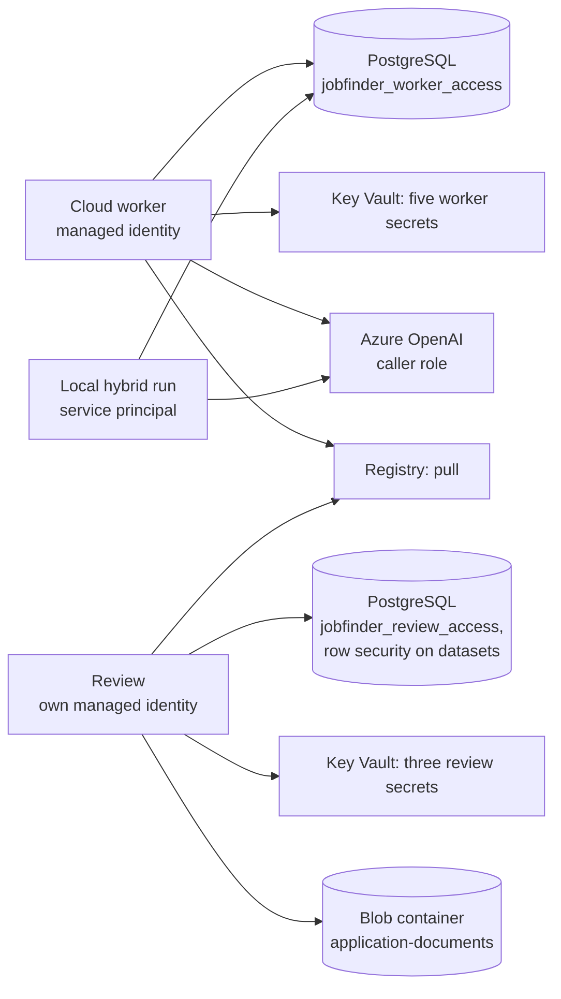

# Separate runtime rights (F09)

F09 is introduced in two stages. `legacy` stays the default; a merge alone
switches no identity and no database login. `prepare` adds logins, while the
existing applications keep running with their earlier logins. Only after a
documented acceptance does `split` follow. During `prepare` the review still has
the earlier broad rights; the separation is not complete then.

## Rights after the switch

| Area | Cloud worker | Review | Local hybrid worker |
| --- | --- | --- | --- |
| Identity | earlier worker managed identity | own review managed identity | earlier own service principal |
| ACR | AcrPull | AcrPull | pull through the host's sign-in |
| Key Vault | five single worker secrets | three single review secrets | no vault role; local ignored configuration |
| Model | existing caller role | no model role | existing optional caller role |
| Blob documents | no data access | Contributor only on the document container | no data access |
| Terraform state | no access | no access | no access |
| Database login | `jobfinder_worker` | `jobfinder_review` | `jobfinder_hybrid` |
| Database group | `jobfinder_worker_access` | `jobfinder_review_access` | `jobfinder_worker_access` |

Worker secrets: `DiscordWebhookUrl`, `StartupJobsApiKey`,
`JobfinderWorkerDatabaseUrl`, `JobfinderUserSettings`, `JobfinderProfile`.
Review secrets: `JobfinderReviewDatabaseUrl`, `ReviewAadClientSecret`,
`JobfinderUserSettings`. In particular, after `split` worker and review get no
access to the old shared `JobfinderDatabaseUrl`; the review gets neither the
Discord webhook nor the profile or a source API key. The database values are
prepared outside Terraform, so no passwords end up in the state. Secret roles
sit on single secret resources of the existing vault.
[Microsoft: Key Vault RBAC](https://learn.microsoft.com/en-us/azure/key-vault/general/rbac-guide)

Both planned workers set `JOBFINDER_SKIP_RUN_BACKUP=1`. They write document
metadata with the existing memory adapter but do not touch document bytes. Their
earlier blob roles therefore go away. Manual document backups and restores run
separately as administrator or owner. If the runtime backup is switched on again
later, the actual document access has to be reassessed first. Developer and CI
permissions stay separate.

## PostgreSQL contract

| Tables | Worker/hybrid | Review |
| --- | --- | --- |
| `job_state`, `workflow_history`, `application_documents` | SELECT/INSERT/UPDATE/DELETE | SELECT/INSERT/UPDATE/DELETE |
| `datasets`, `jobs`, `recommendations`, `manual_sources` | SELECT/INSERT/UPDATE/DELETE | SELECT/INSERT/UPDATE/DELETE; row boundary see below |
| `agent_usage`, `agent_fact_sheets` | SELECT/INSERT/UPDATE/DELETE | only SELECT for the cost overview and existing fact sheets |
| `notifications`, `source_cache` | SELECT/INSERT/UPDATE/DELETE | no rights |
| Version markers, import journal and new tables | no rights | no rights |
| DDL, TRUNCATE, role management, object ownership | no rights | no rights |

The lists are fixed explicitly. New tables get no implicit runtime rights. The
preparation refuses privileged existing roles, object ownership, unexpected
memberships and effective additional rights through `PUBLIC`. It repairs no
foreign roles or public rights automatically. Passwords of existing roles are
not replaced automatically.

Revision `0002_runtime_boundaries` enables row level security on `datasets`.
Members of the review group may see and change only `internal/jobs.json`,
`output/recommendations.json` and `internal/manual_jobs_cache.json`. So they
cannot delete a worker data set and thereby remove its `notifications` or
`source_cache` through a foreign key cascade. The membership is recognised also
with `SET ROLE` to the capability group. Table owners and BYPASSRLS principals
must therefore never be runtime roles.
[PostgreSQL: row security](https://www.postgresql.org/docs/18/ddl-rowsecurity.html)

The migration changes no user data, creates no cluster-wide roles and keeps the
earlier shared login. `schema-status` checks the new policy, technically
read-only; a removed or changed policy is not repaired automatically. The
original baseline stays unchanged. An image rollback does not remove the policy;
its downgrade is refused. After the migration, administrators use the current
maintenance version for migration and restore.

The existing adapters still share job and application rows. F09 separates
component rights, but not yet single columns or domain repository contracts. The
further split follows in F17. In F10 the NOLOGIN groups can also be granted to
separate Entra database principals. The first locally prepared connection
building block and the cloud acceptance still needed are in
[database sign-in with Entra](database-auth.md).

## Stage 1: prepare and check

1. Backup and administrative `schema-status` before the approved production
   migration. `job_finder.db migrate` applies `0002_runtime_boundaries` in one
   transaction; worker and review run no migrations.
2. `python scripts/create_runtime_roles.py --target azure` first only checks
   which roles exist. Only `--apply` creates three logins, the two groups and
   the fixed rights. That requires the intact migration. Locally the same with
   `--target local`; checking locally means changing no production.
3. The helper creates `.env.runtime-azure` or `.env.runtime-local`. The files
   are ignored and contain secrets; limit their access rights like those of the
   existing local `.env` files. A prepared file stays on
   `JOBFINDER_RUNTIME_ACCESS=legacy`. The ready marker is set to `1` only after
   successful own connections and a check of the effective rights. An aborted
   run with marker `0` must not trigger a switch.
4. Store the two cloud DSNs from the file as new worker and review secrets in
   the vault, without printing values in the terminal, in shell arguments or in
   the Terraform state. The helper writes neither Key Vault nor the existing
   runtime configuration.
5. Plan and approve Terraform with `runtime_identity_phase=prepare`. CI uses the
   repository variable `RUNTIME_IDENTITY_PHASE` for that;
   `RUNTIME_ACCESS_VERIFIED` stays `false`. The new review managed identity is
   attached in addition; registry, active secret references and client ID stay
   on the earlier login. The new roles can propagate before the switch.
6. With separately approved, short trial starts and the new identities, confirm
   image pull, resolution of the own secret references and the database
   connection. No complete finder run, Discord message or model generation for
   the trial. Review: loading, note/decision, manual import and document access
   with synthetic test data; worker: database and source configuration without
   model or webhook calls. Remove the document trials afterwards. Document the
   results privately.
7. Check allowed and forbidden cloud access separately: the review gets no model
   right, no webhook, profile or worker DSN access and no state access; the
   worker has no document rights after the transitional right is removed. Check
   existing role assignments including higher scopes and memberships. Secret
   metadata and RBAC and model configuration are enough for the negative check,
   without reading foreign secret values or paying for model calls. The
   functional resolution of the own secrets is checked in the trial start.

Local database tests and simulated Terraform plans prove the prepared contract.
They prove neither Azure role propagation nor a real image pull. That is why
`runtime_access_verified=true` is a separately documented human acceptance, not
a result of `terraform validate` or `depends_on`.

## Stage 2: switch and accept

1. Only after stage 1, approve `runtime_identity_phase=split` and
   `runtime_access_verified=true`. In CI the two repository variables correspond
   to them. Terraform refuses a split without the acceptance marker.
2. The plan must separate the review completely from the worker managed
   identity, move all three review secret references and its client ID to the
   new managed identity and change both cloud DSNs. The earlier broad vault,
   worker and hybrid blob roles are removed; the review stays limited to its
   document container. Easy Auth, owner restriction, ingress order and delete
   protection stay. On unexpected replace or delete actions, do not apply.
3. Before revoking the blob roles, check the existing storage delete lock: it
   can also block subordinate management actions. If needed, revoke exactly the
   affected role assignments in a separately approved owner maintenance window
   and restore the lock right away; then reconcile state and plan. No automatic
   removal of the lock.
   [Microsoft: resource locks](https://learn.microsoft.com/en-us/azure/azure-resource-manager/management/lock-resources)
4. Locally, set `JOBFINDER_RUNTIME_ACCESS=split` in the ignored runtime file
   only after the database acceptance. The hybrid runner then uses its own
   hybrid DSN; a missing ready marker aborts. TLS certificate verification is
   kept in the container as well. The old `.env.postgres-azure` stays as the way
   back.
5. After the switch, check review start, sign-in and document access, the first
   normal worker and hybrid run and the negative rights again. Only then mark F09
   as complete in production. The preparation script refuses later maintenance
   of a runtime file that is already activated.

## Way back

On errors, first stop the affected component. The old shared database login and
its secret are kept. `prepare` can restore the transitional rights; only after
their propagation and a check switch back to the old client ID, registry
identity and DSNs. The local activation can be set back to `legacy` in a
controlled way. That temporarily restores the old broader rights as well and has
to be accepted separately as a way back. No database downgrades, no password
rotation and no removal of the new roles are needed for it. Trial starts and the
production switch belong to a separate approval after the local PR, not to the
local preparation.
